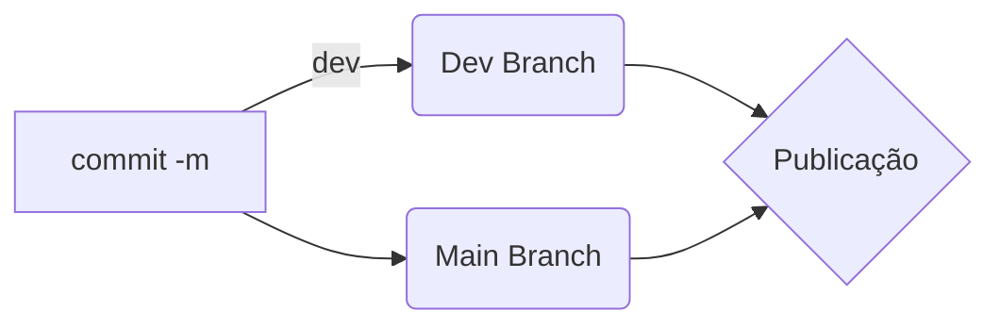

## Grupo IDSOFT

Desenvolvemos softwares empregando inteligência artificial minimizando erros e economizando seu tempo e dinheiro.  
  
Entendemos que cada realidade tem sua particularidade, por isso  valorizamos relações estreitas com nossos clientes a fim de garantir  que a melhor solução será entregue.

# Equipe
Açucena Góis Parente - CEO e Gestora de Projetos
Allef R. Schmidt - Desenvolvedor Frontend
Agnaldo Cordeiro - Desenvolvedor Fullstack
Felipe Moreira - Engenheiro de Dados
Pedro Carrera - Social Media

